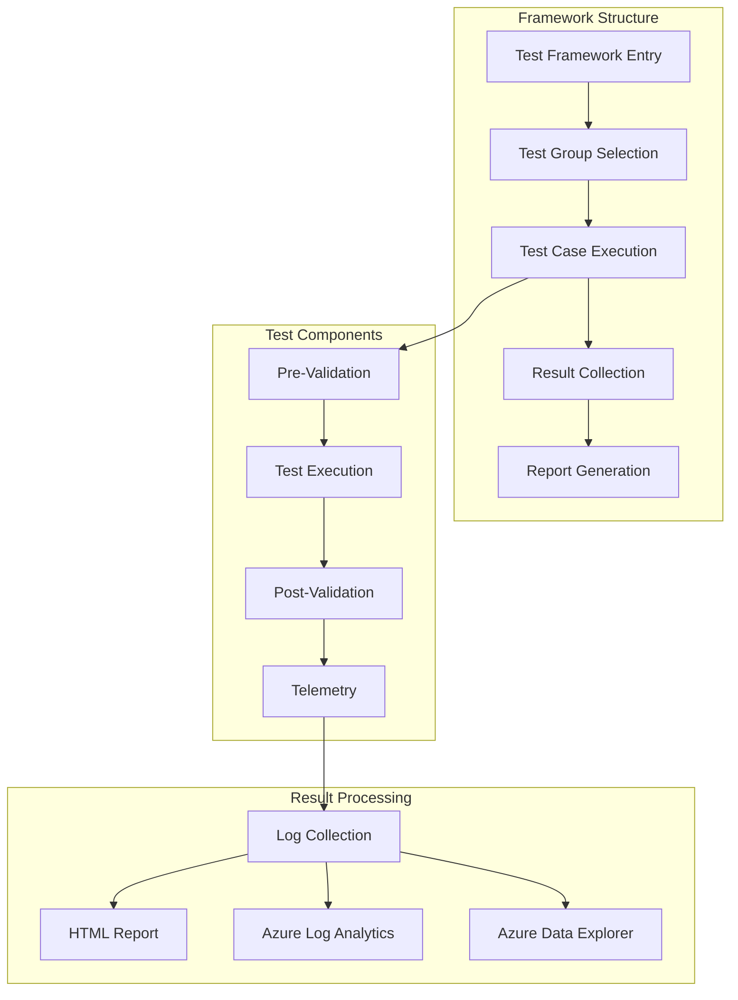
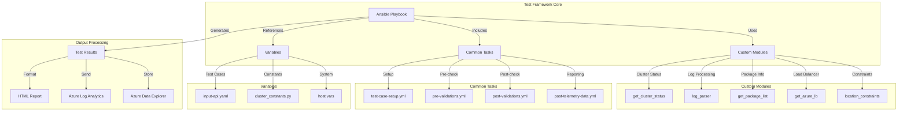
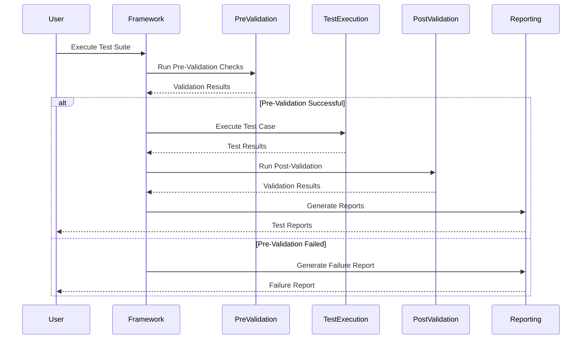

# Architecture and Components

## Key Components

### Core Framework

- **Ansible Playbooks**: Automated test execution and system validation
- **Test Scripts**: Helper utilities for test case management
- **WORKSPACES**: System-specific configuration and credentials management
- **Reporting Engine**: Generates detailed HTML test reports


## Architecture

### High-Level Framework Structure



### Detailed Component Architecture



## Directory Structure
```
src/
├── module_utils/          # Shared utilities and constants
├── modules/              # Custom Ansible modules
├── roles/               # Test implementation roles
│   ├── ha_db_hana/     # HANA HA test cases
│   ├── ha_scs/         # SCS HA test cases
│   └── misc/           # Common tasks
├── templates/          # Report and configuration templates
└── vars/              # Framework configuration
```

## Test Execution Flow

