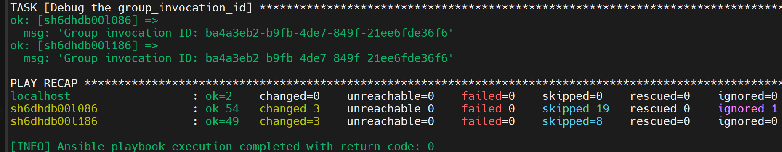

# SAP Configuration Checks

SAP Configuration Checks is an integral part of the SAP Testing Automation framework, providing comprehensive validation of SAP system configurations on Azure infrastructure. This module ensures that SAP Database and SAP Central Services deployments meet enterprise requirements for compliance before entering production. This tool is designed to identify misconfigurations, deviations from best practices, and potential issues that could impact system's stability and performance.

This tool is a new version of the existing [Quality Checks scripts](https://github.com/Azure/SAP-on-Azure-Scripts-and-Utilities/tree/main/QualityCheck), re-architected to provide a extensible, and maintainable solution. It leverages Python for core logic and Ansible for orchestration.

## Overview

Configuration validation serves as a critical quality gate in the SAP deployment lifecycle by:

- **Validating Azure Infrastructure**: Ensuring compute, storage, and network configurations align with SAP best practices
- **Verifying SAP Parameters**: Checking critical SAP HANA and application server settings
- **Assessing Cluster Health**: Validating Pacemaker configurations and resource constraints
- **Ensuring Compliance**: Confirming adherence to organizational and SAP security standards

## Configuration Check Categories

The configuration checks are organized into logical groups that can be executed independently or all at once. The main categories are:

1. **Infrastructure**
   - While not a separate execution category, infrastructure checks are performed as part of the other categories.
   - **Azure Compute**: VM SKU, Accelerated Networking, Availability Set/Zone, Proximity Placement Group.
   - **Storage**: Use of Premium SSD/Ultra Disk, Write Accelerator, disk caching policies, and redundancy settings.

2. **Database**
   - Validates SAP HANA or IBM DB2 specific settings.
   - **SAP HANA**: Checks memory allocation, system replication parameters, and Pacemaker cluster configurations (resource agents, fencing, constraints).
   - **IBM DB2**: Verifies hardware requirements, system language, and OS tuning parameters.

3. **Central Services**
   - Validates the configuration of ASCS (ABAP SAP Central Services) and ERS (Enqueue Replication Server) instances.
   - Checks for virtual hostname configuration, file system mount options, and service startup ordering.

4. **Application Servers**
   - Validates the configuration of the application server instances.

> [!NOTE]
>
> High Availability (HA) configuration checks and functional tests are currently supported only for SAP HANA databases. For IBM DB2 databases, only non-HA configuration checks are available.

## Pre-requisites

### 1. Setup Configuration

Follow the steps (1.1 - 1.5) in [Setup Guide for SAP Testing Automation Framework](./SETUP.MD) to set up the framework on a management server.

### 2. System Configuration

Update the `TEST_TYPE` parameter in [`vars.yaml`](./../vars.yaml) file to `ConfigurationChecks` to enable the Configuration Checks test scenarios.

Follow the steps (2.1 - 2.2) in [Setup Guide for SAP Testing Automation Framework](./SETUP.MD#2-system-configuration) to configure your system details.

### 3. Required Access and Permissions (required)

Effective configuration validation requires that the management server's managed identity (system or user assigned) has read permissions on all target Azure resources. This allows the framework to inspect the settings of services including, but not limited to, Azure Load Balancers, storage solutions (Managed Disks, Azure Files, Azure NetApp Files), and network infrastructure. Lacking the necessary access will prevent the configuration checks from identifying potential misconfigurations in the environment. For more details on configuring system assigned managed identity vs user assigned managed identity, see [Setup Guide for SAP Testing Automation Framework](./SETUP.MD#4-identity-and-authorization).

1. Depending on the type of managed identity method you want to use, configure managed identity on management server
   - [Configuring access using user-assigned managed identity](./SETUP.MD#option-1-user-assigned-managed-identity).
   - [Configuring access using system-assigned managed identity](./SETUP.MD#option-2-system-assigned-managed-identity).
2. Grant the managed identity (system- or user-assigned) the built-in **Reader** role on every resource group that contains SAP system components (VMs, managed disks, load balancers, virtual network, shared storage such as Azure NetApp Files or Azure Files). If everything resides in a single resource group, one assignment there is sufficient; if components are split across multiple resource groups, add a **Reader** role assignment on each resource group to allow the configuration checks to read and validate all infrastructure settings.

## Test Execution

You first need to make sure that you are logged into Azure CLI on the management server VM with the appropriate subscription context:

```bash
# Login to Azure using System Assigned Managed Identity
az login --identity

# Login to Azure using User Assigned Managed Identity
az login --identity -u <client-id-of-user-assigned-managed-identity>

# Set the desired subscription context
az account set --subscription <subscription-id>
```

To execute the script, run following command:

```bash
# Help option
./scripts/sap_automation_qa.sh --help

# Run all the configuration checks with default parameters
./scripts/sap_automation_qa.sh

# Run checks with verbose logging
./scripts/sap_automation_qa.sh -vv

# Run only Database configuration checks (supports both HANA and DB2)
./scripts/sap_automation_qa.sh --extra-vars='{"configuration_test_type":"Database"}'

# Run only ASCS/ERS configuration checks
./scripts/sap_automation_qa.sh --extra-vars='{"configuration_test_type":"CentralServiceInstances"}'

# Run only Application Server configuration checks
./scripts/sap_automation_qa.sh --extra-vars='{"configuration_test_type":"ApplicationInstances"}'
```

## Viewing Test Results

After the test execution completes, a detailed HTML report is generated. The report provide the summary of each test cases that got executed for each VM.

**To locate and view your test report:**

1. **Navigate to your SAP system’s workspace directory:**

   Replace `<SYSTEM_CONFIG_NAME>` with the name of your SAP system configuration (for example, `DEV-WEEU-SAP01-X00`):

   ```bash
   cd WORKSPACES/SYSTEM/<SYSTEM_CONFIG_NAME>/quality_assurance/
   ```
  
2. **Find your report file:**

   The report file is named using the following format:

   ```html
   all_{DISTRO}_{INVOCATION_ID}.html
   ```

   - `DISTRO`: Linux distribution (SLES or RHEL)

   - `INVOCATION_ID`: A unique identifier (Group invocation ID) for the test run which is logged at the end of test execution. Find example screenshot below:

   

3. **View the report**

   You can open the HTML report in any web browser to review the results and logs.
