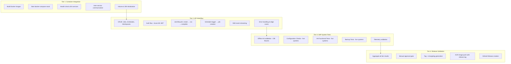
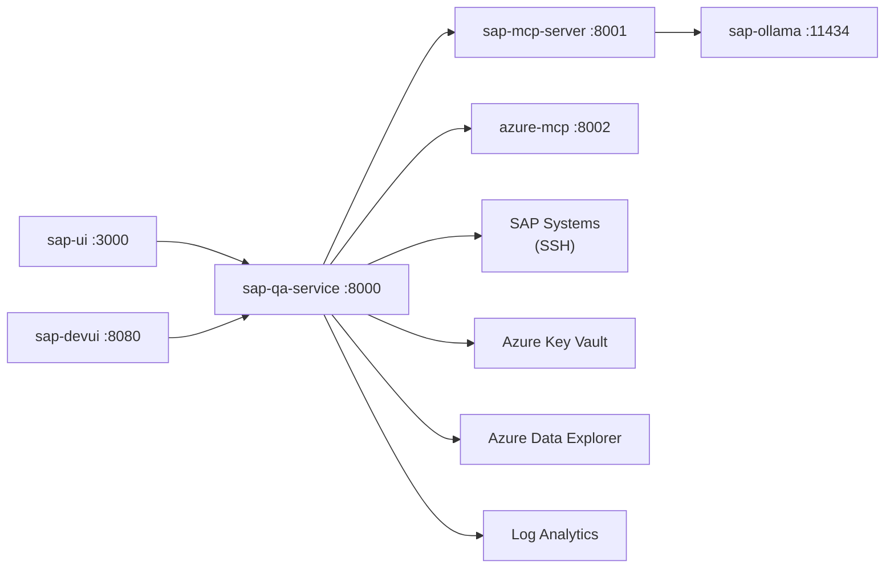
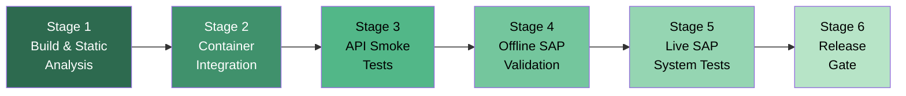
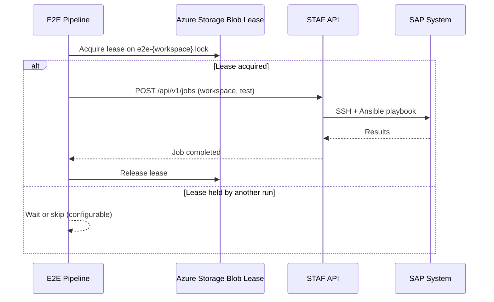
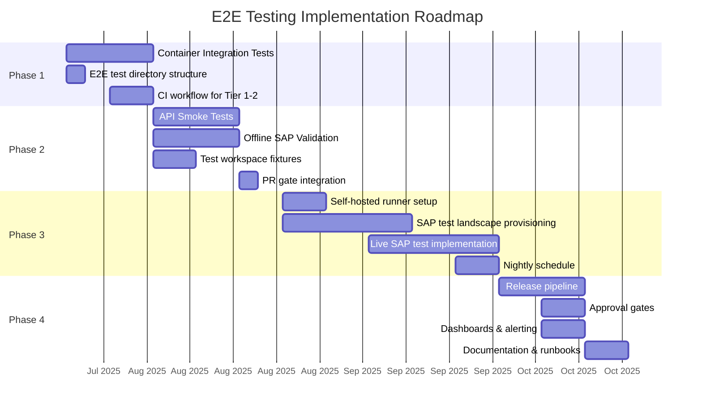
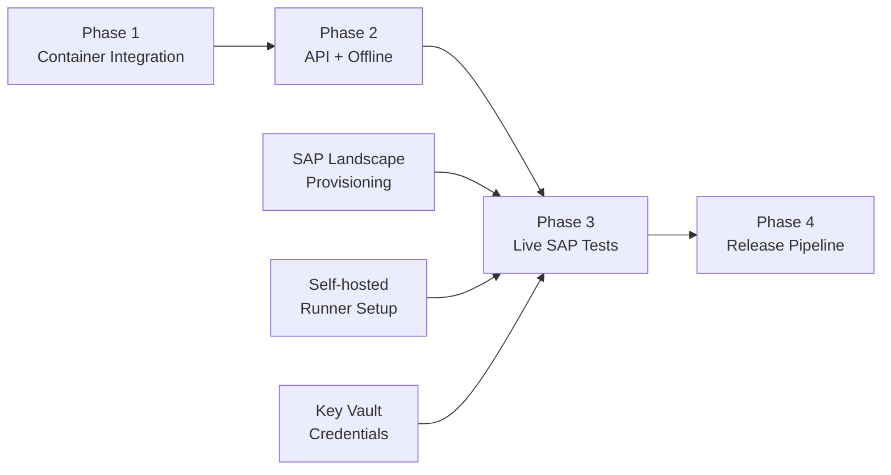

# PRD: End-to-End Testing & Release Pipeline for SAP Testing Automation Framework

> **Authors**: Ripley (QA Architect) · Hicks (E2E & Release Validation Specialist)
> **Version**: 1.0 | **Status**: Draft
> **Date**: 2025-07-14
> **Stakeholders**: Engineering Leadership, DevOps, QA, SAP Basis Teams

---

## Table of Contents

- [1. Executive Summary](#1-executive-summary)
- [2. Scope & Objectives](#2-scope--objectives)
- [3. E2E Test Architecture](#3-e2e-test-architecture)
- [4. Infrastructure Requirements](#4-infrastructure-requirements)
- [5. Test Stages (Pipeline Design)](#5-test-stages-pipeline-design)
- [6. Test Environment Management](#6-test-environment-management)
- [7. Test Execution Matrix](#7-test-execution-matrix)
- [8. Observability & Debugging](#8-observability--debugging)
- [9. Security Considerations](#9-security-considerations)
- [10. Implementation Roadmap](#10-implementation-roadmap)
- [11. Risk Register](#11-risk-register)
- [12. Open Questions](#12-open-questions)
- [Appendix A: Example Workflow Snippets](#appendix-a-example-workflow-snippets)
- [Appendix B: API Test Script Examples](#appendix-b-api-test-script-examples)

---

## 1. Executive Summary

### The Gap

The SAP Testing Automation Framework (STAF) has **1,837 unit tests** across 325 test classes
enforcing 85% code coverage. It has 13 CI/CD workflows covering static analysis, container
builds, and security scanning. What it does **not** have is any validation that the system
actually works when assembled and pointed at real infrastructure.

Every test today uses mocked stores, mocked executors, and mocked Ansible runners. No test
verifies that:

- Docker containers start, discover each other, and pass health checks
- The API accepts a job request, queues it, runs an Ansible playbook, and streams events back
- An Ansible playbook can SSH into a real SAP system and execute HA validation
- A scheduled cron job fires, creates jobs across workspaces, and collects results
- Telemetry data lands in Azure Log Analytics and Azure Data Explorer
- A release image built from `main` actually functions end-to-end

This PRD defines a **four-tier E2E testing strategy** and a **release pipeline** that closes
the gap between "all tests pass" and "this release works in production."

### Business Value

| Metric | Current | Target |
|--------|---------|--------|
| **Release confidence** | Manual smoke test by developer | Automated multi-tier gate |
| **Defect escape rate** | Unknown (no E2E signal) | < 2% of releases require hotfix |
| **Release cadence** | Ad-hoc, manual tagging | Weekly automated releases with approval gate |
| **Mean time to detect** | Found by customer | Found in pipeline within 45 min |
| **Regression detection** | Unit tests only | Unit + container + API + SAP system |
| **MTTR for E2E failures** | N/A | < 4 hours (with artifact collection) |

---

## 2. Scope & Objectives

### What "E2E" Means Here

End-to-end testing for STAF means validating the **complete vertical slice** from
infrastructure provisioning through SAP test execution:

```
Build image → Start containers → API accepts request → Job queued →
Ansible playbook runs → SSH to SAP system → HA test executes →
Results collected → Telemetry sent → Report generated → Release tagged
```

This is infrastructure-level testing, not browser testing. The system under test is a
**distributed service stack** (6 containers) that orchestrates **Ansible automation** against
**real SAP HANA/SCS clusters on Azure**.

### In-Scope

- Docker-compose stack integration testing (all 6 services)
- Full API lifecycle testing against a running stack
- Offline SAP validation (CIB XML fixtures, no live SAP needed)
- Live SAP system tests (Configuration Checks, HA tests, Backup tests)
- Release pipeline with automated gates and manual approval
- Test environment provisioning and lifecycle management
- Observability and artifact collection for debugging failures

### Out-of-Scope

- Browser/UI testing (React frontend is in early development)
- SAP system provisioning automation (handled by SDAF; consumed as prerequisite)
- Performance/load testing of the API under concurrent users (Phase 5+)
- Multi-region deployment validation
- Chaos engineering beyond the existing HA test scenarios

### Success Metrics

| KPI | Definition | Target | Measurement |
|-----|-----------|--------|-------------|
| Pipeline pass rate | % of E2E runs that pass without flaky failures | > 90% | GitHub Actions metrics |
| E2E execution time | Wall-clock time for full release pipeline | < 90 min (Tier 1-3), < 4 hrs (full) | Pipeline telemetry |
| Defect escape rate | Bugs found in production per release | < 2% | Incident tracking |
| Release cadence | Time between production releases | Weekly (automated) | Release tags |
| MTTR | Time from E2E failure to root cause | < 4 hours | Artifact analysis |

---

## 3. E2E Test Architecture

### Test Environment Tiers



### Tier Characteristics

| Tier | Requires SAP? | Requires Azure? | Run Time | Trigger |
|------|:---:|:---:|----------|---------|
| **Tier 1** Container Integration | ❌ | ❌ | ~5 min | Every PR |
| **Tier 2** API Workflow | ❌ | ❌ (dev mode) | ~10 min | Every PR |
| **Tier 3a** Offline SAP Validation | ❌ | ❌ | ~5 min | Every PR |
| **Tier 3b** Live SAP System Tests | ✅ | ✅ | ~60 min | Nightly + Release |
| **Tier 4** Release Validation | ✅ | ✅ | ~15 min | Release only |

### Service Dependency Graph



---

## 4. Infrastructure Requirements

### 4.1 Management Server (STAF Host)

The E2E pipeline needs a compute environment to run the STAF stack:

| Option | Pros | Cons | Recommendation |
|--------|------|------|----------------|
| **GitHub-hosted runner** | Zero maintenance, scales | No persistent SAP connectivity, 6-hr limit | Tier 1-2 only |
| **Azure VM (self-hosted runner)** | Full control, VNet peering to SAP | Always-on cost, maintenance | Tier 3-4 |
| **AKS** | Scalable, managed | Complexity, overkill for single stack | Future |

**Recommended**: GitHub-hosted for Tier 1-2 (PR gate). Azure VM self-hosted runner for
Tier 3-4 (nightly/release) with VNet peering to SAP landscape.

**VM Specification (self-hosted runner)**:

| Resource | Size | Justification |
|----------|------|---------------|
| SKU | Standard_D4s_v5 (4 vCPU, 16 GB) | Docker-compose stack + Ansible execution |
| OS Disk | 128 GB Premium SSD | Docker images, logs, artifacts |
| Network | VNet peered to SAP landscape | SSH to SAP VMs |
| Identity | System-assigned Managed Identity | Key Vault, ACR, Log Analytics, ADX access |

### 4.2 SAP Test Landscape

Dedicated SAP systems for E2E testing. These are **not** shared with development or
customer workloads.

| System | Purpose | Topology | OS | Always-On? |
|--------|---------|----------|----|:---:|
| **E2E-HANA-SU** | HANA Scale-Up HA | 2-node HSR + majority maker | SUSE 15 SP5 | Nightly schedule |
| **E2E-HANA-SO** | HANA Scale-Out HSR | 3+3 node HSR | SUSE 15 SP5 | On-demand |
| **E2E-HANA-RH** | HANA HA (RHEL) | 2-node HSR | RHEL 8.8 | Nightly schedule |
| **E2E-SCS-SUSE** | SCS ENSA2 | 2-node ASCS/ERS | SUSE 15 SP5 | Nightly schedule |
| **E2E-SCS-RHEL** | SCS ENSA2 | 2-node ASCS/ERS | RHEL 8.8 | Nightly schedule |
| **E2E-BACKUP** | Azure Backup HANA | Single-node HANA | SUSE 15 SP5 | On-demand |

**Workspace Configurations**: Each system gets a workspace directory under `WORKSPACES/SYSTEM/`:

```
WORKSPACES/SYSTEM/E2E-HANA-SU/
├── hosts.yaml            # Ansible inventory (DB hosts, SCS hosts, etc.)
├── sap-parameters.yaml   # sap_sid, platform, HA flags, Key Vault refs
├── quality_assurance/    # Test report output
└── offline_validation/   # Cached CIB XML for offline tests
```

### 4.3 Azure Resources

| Resource | Purpose | SKU/Tier |
|----------|---------|----------|
| **Key Vault** | SSH keys, service credentials | Standard |
| **Log Analytics Workspace** | Telemetry sink for test validation | Pay-as-you-go |
| **Azure Data Explorer** | Telemetry sink (Kusto) for test validation | Dev/Test SKU |
| **Container Registry** | Release images | Basic |
| **Storage Account** | Test artifacts, CIB fixtures | Standard LRS |
| **VNet + NSGs** | Network isolation, SAP connectivity | - |
| **Managed Identity** | Passwordless auth for all Azure services | System-assigned |

### 4.4 Authentication & Credentials

| Credential | Storage | Consumer | Rotation |
|-----------|---------|----------|----------|
| SSH keys (SAP VMs) | Azure Key Vault | `SshCredentialProvider` in `worker.py` | 90 days |
| Azure AD app registration | Entra ID | `AuthMiddleware` in `auth.py` | N/A (cert-based) |
| ACR pull credential | Managed Identity | Docker pull in CI | N/A (MI) |
| Log Analytics shared key | Key Vault | `send_telemetry_data.py` | 180 days |
| ADX ingestion credential | Managed Identity | `send_telemetry_data.py` | N/A (MI) |
| GitHub Actions OIDC | GitHub/Azure federation | CI/CD pipeline | N/A |

### 4.5 Cost Estimation

| Component | Monthly Cost (USD) | Notes |
|-----------|-------------------:|-------|
| Self-hosted runner VM (D4s_v5) | ~$140 | Deallocate when idle |
| SAP HANA VMs (4× E32s_v5) | ~$4,800 | Deallocate outside test windows |
| SAP SCS VMs (4× D4s_v5) | ~$560 | Deallocate outside test windows |
| Azure Data Explorer (Dev) | ~$120 | Dev/Test SKU |
| Key Vault + Storage + Networking | ~$30 | Minimal usage |
| **Total (always-on)** | **~$5,650** | |
| **Total (on-demand, 8hr/day)** | **~$2,000** | Auto-start/stop |

**Recommendation**: Use Azure Automation or start/stop schedules to deallocate SAP VMs
outside nightly test windows. Target ~$2,000/month.

---

## 5. Test Stages (Pipeline Design)

### Pipeline Overview



---

### Stage 1: Build & Static Analysis (Existing)

**Status**: ✅ Already implemented in CI

Extends the existing workflows without modification:

| Check | Workflow File | Gate Criteria |
|-------|-------------|---------------|
| Unit tests + coverage | `github-actions-code-coverage.yml` | 85% coverage, all tests pass |
| Code style | `github-actions-code-coverage.yml` | `black --check`, `pylint --fail-under=9` |
| Ansible lint | `github-actions-ansible-lint.yml` | Zero errors |
| Security scan | `codeql.yml` | No high/critical findings |
| Dependency review | `dependency-review.yml` | No known vulnerabilities |
| Container scan | `trivy.yml` | No critical CVEs |
| Docker build | `docker-build-push.yml` | Image builds successfully |

**No changes needed** — Stage 1 is the existing CI gate.

---

### Stage 2: Container Integration Tests (NEW)

**Goal**: Verify the Docker-compose stack starts, all services are healthy, and inter-service
communication works.

**Runner**: GitHub-hosted (ubuntu-latest) — no SAP/Azure access needed.

**Prerequisites**: Docker Buildx, docker-compose plugin.

#### Test Cases

| ID | Test | Validation | Timeout |
|----|------|-----------|---------|
| `CI-001` | Build all images | `docker compose build` exits 0 | 10 min |
| `CI-002` | Start full stack | `docker compose up -d` with all 6 services | 3 min |
| `CI-003` | API health check | `GET /healthz` returns 200, `core: healthy` | 90s |
| `CI-004` | MCP server health | `GET :8001/mcp` returns 200 | 60s |
| `CI-005` | Ollama health | `GET :11434/api/tags` returns 200 | 90s |
| `CI-006` | Azure MCP health | `GET :8002/mcp` (maps to :5000 internal) returns 200 | 60s |
| `CI-007` | UI reachable | `GET :3000` returns 200 | 60s |
| `CI-008` | DevUI reachable | `GET :8080` returns 200 | 60s |
| `CI-009` | Service dependency chain | API reports MCP + Ollama as healthy in `/healthz` | 30s |
| `CI-010` | SQLite DB initialized | `staf.db` exists in data volume, tables present | 10s |
| `CI-011` | Volume mounts | WORKSPACES directory accessible, vars.yaml readable | 10s |
| `CI-012` | Log output | JSON-format logs produced by all services | 10s |
| `CI-013` | Graceful shutdown | `docker compose down` exits cleanly, no orphan processes | 30s |

#### Implementation

```bash
# tests/e2e/test_container_integration.sh
#!/usr/bin/env bash
set -euo pipefail

COMPOSE_FILE="deploy/docker-compose.yml"
TIMEOUT_HEALTH=120
FAILURES=0

log() { echo "[$(date -u +%H:%M:%S)] $*"; }

# CI-001: Build
log "CI-001: Building images..."
docker compose -f "$COMPOSE_FILE" build --quiet || { log "FAIL: CI-001"; ((FAILURES++)); }

# CI-002: Start
log "CI-002: Starting stack..."
docker compose -f "$COMPOSE_FILE" up -d

# CI-003..CI-008: Health checks
wait_for_health() {
  local name=$1 url=$2 timeout=$3
  local elapsed=0
  while ! curl -sf "$url" > /dev/null 2>&1; do
    sleep 2; elapsed=$((elapsed + 2))
    if [ $elapsed -ge "$timeout" ]; then
      log "FAIL: $name (timeout ${timeout}s)"
      ((FAILURES++)); return 1
    fi
  done
  log "PASS: $name (${elapsed}s)"
}

wait_for_health "CI-003: API"       "http://localhost:8000/healthz"     "$TIMEOUT_HEALTH"
wait_for_health "CI-004: MCP"       "http://localhost:8001/mcp"         90
wait_for_health "CI-005: Ollama"    "http://localhost:11434/api/tags"   90
wait_for_health "CI-006: AzureMCP"  "http://localhost:8002/mcp"         60
wait_for_health "CI-007: UI"        "http://localhost:3000"             60
wait_for_health "CI-008: DevUI"     "http://localhost:8080"             60

# CI-009: Dependency chain
log "CI-009: Checking dependency health..."
HEALTH=$(curl -sf http://localhost:8000/healthz)
echo "$HEALTH" | python3 -c "
import json, sys
h = json.load(sys.stdin)
assert h['status'] in ('healthy', 'degraded'), f'Unexpected status: {h[\"status\"]}'
print('PASS: CI-009')
" || { log "FAIL: CI-009"; ((FAILURES++)); }

# CI-013: Graceful shutdown
log "CI-013: Shutting down..."
docker compose -f "$COMPOSE_FILE" down --volumes --remove-orphans || { log "FAIL: CI-013"; ((FAILURES++)); }

log "Container integration: $FAILURES failures"
exit $FAILURES
```

---

### Stage 3: API Smoke Tests (NEW)

**Goal**: Validate the full API lifecycle against a running stack with `AUTH_DEV_MODE=true`.

**Runner**: GitHub-hosted (ubuntu-latest). Stack started in Stage 2 is reused (or re-started).

**Prerequisites**: Running docker-compose stack, test workspace directories seeded.

#### Test Cases

| ID | Test | Method | Endpoint | Validation |
|----|------|--------|----------|-----------|
| `API-001` | Health check | GET | `/healthz` | 200, `status` field present |
| `API-002` | Version info | GET | `/api/v1/version` | 200, `version` matches `VERSION` file |
| `API-003` | List workspaces | GET | `/api/v1/workspaces` | 200, `total >= 1` |
| `API-004` | Get workspace config | GET | `/api/v1/workspaces/{id}/config` | 200, `sap_sid` present |
| `API-005` | Create job | POST | `/api/v1/jobs` | 201, job `status == "pending"` |
| `API-006` | Get job | GET | `/api/v1/jobs/{id}` | 200, correct `workspace_id` |
| `API-007` | List jobs | GET | `/api/v1/jobs?workspace_id=X` | 200, filtered results |
| `API-008` | Cancel job | POST | `/api/v1/jobs/{id}/cancel` | 200, job status becomes `cancelled` |
| `API-009` | Get job events | GET | `/api/v1/jobs/{id}/events` | 200, events array includes `CREATED` |
| `API-010` | Get job log | GET | `/api/v1/jobs/{id}/log` | 200 or 404 (no log yet) |
| `API-011` | Create schedule | POST | `/api/v1/schedules` | 201, `next_run_time` populated |
| `API-012` | List schedules | GET | `/api/v1/schedules` | 200, `total >= 1` |
| `API-013` | Update schedule | PATCH | `/api/v1/schedules/{id}` | 200, fields updated |
| `API-014` | Trigger schedule | POST | `/api/v1/schedules/{id}/trigger` | 200, `job_ids` array non-empty |
| `API-015` | Get schedule jobs | GET | `/api/v1/schedules/{id}/jobs` | 200, includes triggered job |
| `API-016` | Delete schedule | DELETE | `/api/v1/schedules/{id}` | 200 |
| `API-017` | Invalid job request | POST | `/api/v1/jobs` (bad body) | 422 |
| `API-018` | Non-existent job | GET | `/api/v1/jobs/fake-uuid` | 404 |
| `API-019` | Duplicate workspace lock | POST | `/api/v1/jobs` (same workspace, active job) | 409 |
| `API-020` | Auth config endpoint | GET | `/auth/config` | 200, config returned |
| `API-021` | Workspace reports list | GET | `/api/v1/workspaces/{id}/reports` | 200, array response |

#### Implementation

```python
# tests/e2e/test_api_smoke.py
"""
API smoke tests against a running STAF stack.

Usage:
  STAF_API_URL=http://localhost:8000 pytest tests/e2e/test_api_smoke.py -v
"""
import os
import time

import httpx
import pytest

BASE_URL = os.environ.get("STAF_API_URL", "http://localhost:8000")
API = f"{BASE_URL}/api/v1"
WORKSPACE_ID = os.environ.get("STAF_TEST_WORKSPACE", "E2E-SMOKE")


@pytest.fixture(scope="module")
def client():
    with httpx.Client(base_url=BASE_URL, timeout=30.0) as c:
        yield c


class TestHealthAndVersion:
    def test_health(self, client):  # API-001
        r = client.get("/healthz")
        assert r.status_code == 200
        assert "status" in r.json()

    def test_version(self, client):  # API-002
        r = client.get(f"{API}/version")
        assert r.status_code == 200
        assert "version" in r.json()


class TestWorkspaces:
    def test_list(self, client):  # API-003
        r = client.get(f"{API}/workspaces")
        assert r.status_code == 200
        assert r.json()["total"] >= 1

    def test_config(self, client):  # API-004
        r = client.get(f"{API}/workspaces/{WORKSPACE_ID}/config")
        assert r.status_code == 200
        assert "sap_sid" in r.json()


class TestJobLifecycle:
    job_id: str = None

    def test_create(self, client):  # API-005
        r = client.post(f"{API}/jobs", json={
            "workspace_id": WORKSPACE_ID,
            "test_group": "ConfigurationChecks",
            "test_ids": [],
        })
        assert r.status_code == 201
        data = r.json()
        assert data["status"] == "pending"
        TestJobLifecycle.job_id = data["id"]

    def test_get(self, client):  # API-006
        r = client.get(f"{API}/jobs/{self.job_id}")
        assert r.status_code == 200
        assert r.json()["workspace_id"] == WORKSPACE_ID

    def test_cancel(self, client):  # API-008
        r = client.post(f"{API}/jobs/{self.job_id}/cancel", json={
            "reason": "E2E smoke test"
        })
        assert r.status_code == 200


class TestScheduleLifecycle:
    schedule_id: str = None

    def test_create(self, client):  # API-011
        r = client.post(f"{API}/schedules", json={
            "name": "E2E Smoke Schedule",
            "cron_expression": "0 0 * * *",
            "workspace_ids": [WORKSPACE_ID],
            "test_group": "ConfigurationChecks",
        })
        assert r.status_code == 201
        TestScheduleLifecycle.schedule_id = r.json()["id"]

    def test_list(self, client):  # API-012
        r = client.get(f"{API}/schedules")
        assert r.status_code == 200
        assert r.json()["total"] >= 1

    def test_update(self, client):  # API-013
        r = client.patch(
            f"{API}/schedules/{self.schedule_id}",
            json={"description": "Updated by E2E"},
        )
        assert r.status_code == 200

    def test_delete(self, client):  # API-016
        r = client.delete(f"{API}/schedules/{self.schedule_id}")
        assert r.status_code == 200


class TestErrorHandling:
    def test_invalid_request(self, client):  # API-017
        r = client.post(f"{API}/jobs", json={"invalid": "body"})
        assert r.status_code == 422

    def test_not_found(self, client):  # API-018
        r = client.get(f"{API}/jobs/00000000-0000-0000-0000-000000000000")
        assert r.status_code == 404
```

---

### Stage 4: Offline SAP Validation (NEW)

**Goal**: Run Ansible playbooks in offline mode using cached CIB XML fixtures. Validates the
full job-execution pipeline without requiring live SAP systems.

**Runner**: GitHub-hosted or self-hosted. No SAP/Azure connectivity needed.

**How it works**: The `playbook_01_ha_offline_tests.yml` playbook reads pre-captured CIB XML
from `WORKSPACES/SYSTEM/{ID}/offline_validation/` and validates HA configuration parsing,
resource detection, and constraint evaluation.

#### Test Cases

| ID | Test | Playbook | Validation |
|----|------|----------|-----------|
| `OFF-001` | Offline HANA HA config (SUSE) | `playbook_01_ha_offline_tests.yml` | CIB XML parsed, resources detected |
| `OFF-002` | Offline HANA HA config (RHEL) | `playbook_01_ha_offline_tests.yml` | RHEL CIB variant parsed correctly |
| `OFF-003` | Offline SCS HA config (SUSE) | `playbook_01_ha_offline_tests.yml` | SCS resources, ENSA2 detected |
| `OFF-004` | Offline SCS HA config (RHEL) | `playbook_01_ha_offline_tests.yml` | RHEL pcs CIB variant |
| `OFF-005` | HTML report generation | `render_html_report.py` module | Report file created in `quality_assurance/` |
| `OFF-006` | Job lifecycle (offline) | API → job → offline playbook → complete | Job transitions: pending → running → completed |

#### Implementation

Offline tests are submitted via the API as regular jobs with the `--offline` flag injected
as an Ansible extra-var:

```bash
# Submit offline HA test via API
curl -X POST http://localhost:8000/api/v1/jobs \
  -H "Content-Type: application/json" \
  -d '{
    "workspace_id": "E2E-OFFLINE-SUSE",
    "test_group": "DatabaseHighAvailability",
    "test_ids": ["ha-config"]
  }'
```

The offline workspace includes pre-captured fixtures:

```
WORKSPACES/SYSTEM/E2E-OFFLINE-SUSE/
├── hosts.yaml                  # localhost inventory (connection: local)
├── sap-parameters.yaml         # HA flags, offline mode enabled
└── offline_validation/
    ├── cib.xml                 # Captured CIB from real SUSE cluster
    ├── sbd_config              # SBD device configuration
    └── corosync.conf           # Corosync configuration
```

---

### Stage 5: Live SAP System Tests (NEW)

**Goal**: Execute actual STAF tests against real SAP HANA and SCS clusters on Azure.

**Runner**: Self-hosted Azure VM with VNet peering to SAP landscape.

**Prerequisites**:
- SAP test systems running and healthy (pre-check stage)
- SSH credentials provisioned in Key Vault
- Workspace configurations deployed
- Azure Managed Identity with required RBAC roles

#### 5a. Pre-Flight Checks

Before running any destructive tests, validate system readiness:

| Check | Command | Pass Criteria |
|-------|---------|---------------|
| SSH connectivity | `ssh -o ConnectTimeout=10 {host}` | All hosts reachable |
| SAP HANA status | `sapcontrol -nr {instance} -function GetProcessList` | GREEN |
| Cluster status | `crm status` (SUSE) / `pcs status` (RHEL) | All resources started |
| Azure LB health | Azure SDK: LB probe status | All probes healthy |
| Key Vault access | `az keyvault secret list` | Credentials accessible |

#### 5b. Test Execution Strategy

Tests are organized into **risk tiers** based on destructiveness:

| Risk Tier | Tests | Frequency | Recovery Time |
|-----------|-------|-----------|---------------|
| **Non-destructive** | ha-config, azure-lb, sapcontrol-config, configuration checks | Every release | None |
| **Recoverable** | resource-migration, ascs-migration, manual-restart | Every release | 2-5 min auto |
| **Destructive** | node-crash, node-kill, block-network, fs-freeze | Nightly only | 5-15 min auto |
| **High-risk** | sbd-fencing, echo-b, block-hana-shared | Weekly only | 10-20 min, may need manual |

#### 5c. HANA Database HA Tests

Mapped to task files in `src/roles/ha_db_hana/tasks/`:

| Test Case | Task File | Risk | SAP System |
|-----------|-----------|------|-----------|
| `ha-config` | `ha-config.yml` | Non-destructive | E2E-HANA-SU |
| `azure-lb` | `azure-lb.yml` | Non-destructive | E2E-HANA-SU |
| `resource-migration` | `resource-migration.yml` | Recoverable | E2E-HANA-SU |
| `primary-node-crash` | `primary-node-crash.yml` | Destructive | E2E-HANA-SU |
| `primary-node-kill` | `primary-node-kill.yml` | Destructive | E2E-HANA-SU |
| `primary-crash-index` | `primary-crash-index.yml` | Destructive | E2E-HANA-SU |
| `primary-echo-b` | `primary-echo-b.yml` | High-risk | E2E-HANA-SU |
| `secondary-node-kill` | `secondary-node-kill.yml` | Destructive | E2E-HANA-SU |
| `secondary-crash-index` | `secondary-crash-index.yml` | Destructive | E2E-HANA-SU |
| `secondary-echo-b` | `secondary-echo-b.yml` | High-risk | E2E-HANA-SU |
| `block-network` | `block-network.yml` | Destructive | E2E-HANA-SU |
| `block-hana-shared` | `block-hana-shared.yml` | High-risk | E2E-HANA-SU |
| `fs-freeze` | `fs-freeze.yml` | Destructive | E2E-HANA-SU |
| `sbd-fencing` | `sbd-fencing.yml` | High-risk | E2E-HANA-SU |

#### 5d. SCS HA Tests

Mapped to task files in `src/roles/ha_scs/tasks/`:

| Test Case | Task File | Risk | SAP System |
|-----------|-----------|------|-----------|
| `ha-config` | `ha-config.yml` | Non-destructive | E2E-SCS-SUSE |
| `azure-lb` | `azure-lb.yml` | Non-destructive | E2E-SCS-SUSE |
| `sapcontrol-config` | `sapcontrol-config.yml` | Non-destructive | E2E-SCS-SUSE |
| `ascs-migration` | `ascs-migration.yml` | Recoverable | E2E-SCS-SUSE |
| `ascs-node-crash` | `ascs-node-crash.yml` | Destructive | E2E-SCS-SUSE |
| `kill-message-server` | `kill-message-server.yml` | Destructive | E2E-SCS-SUSE |
| `kill-enqueue-server` | `kill-enqueue-server.yml` | Destructive | E2E-SCS-SUSE |
| `kill-enqueue-replication` | `kill-enqueue-replication.yml` | Destructive | E2E-SCS-SUSE |
| `kill-sapstartsrv-process` | `kill-sapstartsrv-process.yml` | Destructive | E2E-SCS-SUSE |
| `manual-restart` | `manual-restart.yml` | Recoverable | E2E-SCS-SUSE |
| `ha-failover-to-node` | `ha-failover-to-node.yml` | Recoverable | E2E-SCS-SUSE |
| `block-network` | `block-network.yml` | Destructive | E2E-SCS-SUSE |

#### 5e. Azure Backup Tests

Mapped to task files in `src/roles/backup_db_hana/tasks/`:

| Test Case | Task File | Risk | SAP System |
|-----------|-----------|------|-----------|
| `backup-setup-verification` | `backup-setup-verification.yml` | Non-destructive | E2E-BACKUP |
| `restore-to-db` | `restore-to-db.yml` | Destructive | E2E-BACKUP |
| `restore-to-filesystem` | `restore-to-filesystem.yml` | Destructive | E2E-BACKUP |
| `recover-db-commands` | `recover-db-commands.yml` | Destructive | E2E-BACKUP |
| `restore-cross-vm` | `restore-cross-vm.yml` | Destructive | E2E-BACKUP |

#### 5f. Telemetry Validation

After test execution, verify telemetry data was delivered:

```python
# Validate Log Analytics ingestion
# Query: CustomLogs | where TimeGenerated > ago(30m) | where Category == "STAF"
az monitor log-analytics query \
  --workspace "$LAWS_WORKSPACE_ID" \
  --analytics-query "StafTestResults_CL | where TimeGenerated > ago(30m) | count"

# Validate ADX ingestion
# Query ADX table for recent test records
az kusto query \
  --cluster-uri "$ADX_CLUSTER_FQDN" \
  --database "$ADX_DATABASE_NAME" \
  --query "StafTestResults | where timestamp > ago(30m) | count"
```

---

### Stage 6: Release Gate (NEW)

**Goal**: Aggregate results from all stages, enforce approval, and produce a release.

#### Gate Criteria

| Stage | Required for Release? | Pass Criteria |
|-------|:---:|---------------|
| Stage 1: Build & Static | ✅ | All existing CI checks pass |
| Stage 2: Container Integration | ✅ | All CI-xxx tests pass |
| Stage 3: API Smoke | ✅ | All API-xxx tests pass |
| Stage 4: Offline Validation | ✅ | All OFF-xxx tests pass |
| Stage 5a: Non-destructive SAP | ✅ | ha-config, azure-lb, config checks pass |
| Stage 5b: Destructive SAP | ⚠️ | Required for major releases only |
| Manual Approval | ✅ | Engineering lead sign-off |

#### Release Artifacts

| Artifact | Location | Naming Convention |
|----------|----------|-------------------|
| Docker image | Azure Container Registry | `staf:{version}`, `staf:{git-sha}`, `staf:latest` |
| GitHub Release | GitHub Releases | `v{version}` tag |
| Changelog | `CHANGELOG.md` / Release notes | Auto-generated from commits |
| Test report | Release assets | `e2e-report-{version}.html` |
| Coverage report | Release assets | `coverage-{version}.xml` |

#### Version Bumping

The `VERSION` file (currently `1.0.2`) is the source of truth:

```bash
# Bump version (semver)
current=$(cat VERSION)
# Patch: 1.0.2 → 1.0.3 (automated for non-breaking changes)
# Minor: 1.0.2 → 1.1.0 (new features)
# Major: 1.0.2 → 2.0.0 (breaking changes)
```

---

## 6. Test Environment Management

### 6.1 Provisioning

SAP test landscapes are provisioned using the SAP Deployment Automation Framework (SDAF)
or equivalent IaC. The E2E pipeline **does not** provision SAP systems — it consumes them
as a prerequisite.

**Bootstrap steps for a new E2E environment**:

1. Deploy SAP systems via SDAF (or manual install)
2. Create workspace directory: `WORKSPACES/SYSTEM/{WORKSPACE_ID}/`
3. Configure `hosts.yaml` with SSH-reachable host inventory
4. Configure `sap-parameters.yaml` with SAP SID, HA flags, Key Vault references
5. Store SSH private key in Azure Key Vault
6. Grant Managed Identity access to Key Vault, SAP VNet
7. Run pre-flight checks to validate connectivity

### 6.2 Environment Locking

The STAF `JobWorker` already enforces **one active job per workspace** via workspace locking
in `src/core/execution/worker.py`. The E2E pipeline extends this with a **pipeline-level lock**:



**Implementation**: Azure Storage blob leases (60s, auto-renewed) prevent concurrent E2E
runs on the same SAP system.

### 6.3 Cleanup & Reset

After destructive tests, the SAP cluster must be restored to a known-good state.
STAF already handles this via `block/rescue/always` patterns in Ansible tasks
(e.g., `src/roles/misc/tasks/` post-validation tasks), but the E2E pipeline adds an
explicit **reset gate**:

| Step | Action | Validation |
|------|--------|-----------|
| Post-test validation | Run `ha-config` test | Cluster resources online |
| HANA SR status | Check `SAPHanaSR` attributes | SOK/PRIM/SYNC |
| Pacemaker cleanup | `crm resource cleanup` / `pcs resource cleanup` | No failed actions |
| SAP start | `sapcontrol StartSystem` | All instances GREEN |
| Timeout escalation | If not recovered in 15 min | Alert + manual intervention |

### 6.4 State Management

| Concern | Approach |
|---------|----------|
| Test data isolation | Each E2E run uses unique correlation ID; no shared state between runs |
| CIB XML fixtures | Versioned in `WORKSPACES/SYSTEM/{ID}/offline_validation/`; refreshed monthly |
| HTML reports | Accumulated in `quality_assurance/`; pruned to last 50 per workspace |
| SQLite database | Fresh `staf.db` per E2E run (container volume re-created) |
| Telemetry data | Tagged with `e2e_run_id` for isolation in Log Analytics/ADX queries |

---

## 7. Test Execution Matrix

### 7.1 Trigger → Stage Mapping

| Trigger | S1 Build | S2 Container | S3 API | S4 Offline | S5 Live SAP | S6 Release |
|---------|:---:|:---:|:---:|:---:|:---:|:---:|
| **Pull Request** | ✅ | ✅ | ✅ | ✅ | ❌ | ❌ |
| **Push to main** | ✅ | ✅ | ✅ | ✅ | ❌ | ❌ |
| **Nightly (cron)** | ✅ | ✅ | ✅ | ✅ | ✅ (full) | ❌ |
| **Release (manual)** | ✅ | ✅ | ✅ | ✅ | ✅ (gated) | ✅ |
| **Hotfix** | ✅ | ✅ | ✅ | ✅ | ✅ (subset) | ✅ |

### 7.2 Live SAP Test Frequency

| Test Risk Tier | PR | Nightly | Weekly | Release |
|---------------|:---:|:---:|:---:|:---:|
| Non-destructive (config, LB) | ❌ | ✅ | ✅ | ✅ |
| Recoverable (migration, restart) | ❌ | ✅ | ✅ | ✅ |
| Destructive (crash, kill, network) | ❌ | ✅ | ✅ | ⚠️ Major only |
| High-risk (SBD, echo-b, HANA-shared) | ❌ | ❌ | ✅ | ⚠️ Major only |

### 7.3 OS Coverage Matrix

| Test Suite | SUSE (crm) | RHEL (pcs) |
|-----------|:---:|:---:|
| HANA HA | ✅ E2E-HANA-SU | ✅ E2E-HANA-RH |
| SCS HA | ✅ E2E-SCS-SUSE | ✅ E2E-SCS-RHEL |
| Configuration Checks | ✅ | ✅ |
| Backup | ✅ E2E-BACKUP | ❌ (SUSE only initially) |
| Offline Validation | ✅ CIB fixtures | ✅ CIB fixtures |

### 7.4 Parallelization Strategy

```mermaid
gantt
    title E2E Pipeline Execution Timeline
    dateFormat X
    axisFormat %M min

    section Stage 1 (5 min)
    Unit + Lint + Security    :s1, 0, 5

    section Stage 2 (5 min)
    Container Integration     :s2, 5, 10

    section Stage 3 (10 min)
    API Smoke Tests           :s3, 10, 20

    section Stage 4 (5 min)
    Offline Validation        :s4, 10, 15

    section Stage 5 (parallel, 60 min)
    HANA HA (SUSE)           :s5a, 20, 80
    HANA HA (RHEL)           :s5b, 20, 80
    SCS HA (SUSE)            :s5c, 20, 60
    SCS HA (RHEL)            :s5d, 20, 60
    Config Checks            :s5e, 20, 35
    Backup Tests             :s5f, 20, 50

    section Stage 6 (15 min)
    Release Gate             :s6, 80, 95
```



**Key**: Stages 3 and 4 run in parallel. Within Stage 5, each SAP system runs independently
on separate self-hosted runners (or sequentially on a single runner with system isolation).

### 7.5 Timeout & Retry Policies

| Stage | Timeout | Retries | Retry Delay |
|-------|---------|---------|-------------|
| Container build | 15 min | 1 | Immediate |
| Service health check | 120s per service | 3 | 10s exponential |
| API smoke test | 30s per request | 0 | — |
| Offline validation | 10 min per test | 1 | Immediate |
| Live SAP test (non-destructive) | 15 min | 1 | 60s |
| Live SAP test (destructive) | 30 min | 0 | — (no retry for destructive) |
| Cluster recovery | 20 min | 1 | Manual escalation |
| Telemetry validation | 5 min | 3 | 30s (ingestion delay) |

---

## 8. Observability & Debugging

### 8.1 Test Result Dashboards

| Dashboard | Platform | Content |
|-----------|----------|---------|
| **E2E Pipeline Summary** | GitHub Actions summary | Pass/fail per stage, duration, link to artifacts |
| **SAP Test Results** | Azure Data Explorer | Test case results, duration, failure analysis |
| **Trend Analysis** | ADX workbook | Pass rate over time, flaky test detection, MTTR |
| **Infrastructure Health** | Azure Monitor | VM availability, SAP system uptime, cluster status |

**ADX Query - E2E Run Summary**:

```kusto
StafTestResults
| where e2e_run_id == "{RUN_ID}"
| summarize
    total = count(),
    passed = countif(status == "PASS"),
    failed = countif(status == "FAIL"),
    skipped = countif(status == "SKIP"),
    duration_min = sum(duration_seconds) / 60.0
    by test_group, workspace_id
| order by test_group asc
```

### 8.2 Log Aggregation

During E2E execution, logs from all layers are collected:

| Source | Log Location | Collection Method |
|--------|-------------|-------------------|
| STAF API | Container stdout (JSON) | `docker compose logs` |
| MCP Server | Container stdout (JSON) | `docker compose logs` |
| Ollama | Container stdout | `docker compose logs` |
| Ansible playbook | `WORKSPACES/SYSTEM/{ID}/quality_assurance/*.log` | Artifact upload |
| SAP system logs | `/var/log/messages` on SAP VMs | `log_parser.py` module |
| Pacemaker logs | `/var/log/pacemaker/pacemaker.log` | Collected post-test |
| Pipeline logs | GitHub Actions log | Native |

### 8.3 Artifact Collection on Failure

When any E2E stage fails, the pipeline collects diagnostic artifacts:

```yaml
# In GitHub Actions workflow
- name: Collect failure artifacts
  if: failure()
  run: |
    mkdir -p artifacts/
    # Container logs
    docker compose -f deploy/docker-compose.yml logs --no-color > artifacts/docker-logs.txt 2>&1
    # SQLite database
    cp data/staf.db artifacts/ 2>/dev/null || true
    # Ansible logs
    cp -r WORKSPACES/SYSTEM/*/quality_assurance/*.log artifacts/ 2>/dev/null || true
    # Cluster state (if SSH available)
    ssh $SAP_HOST "crm status; crm configure show" > artifacts/cluster-state.txt 2>/dev/null || true
    # CIB XML dump
    ssh $SAP_HOST "cibadmin --query" > artifacts/cib-dump.xml 2>/dev/null || true

- name: Upload artifacts
  if: failure()
  uses: actions/upload-artifact@v4
  with:
    name: e2e-failure-artifacts-${{ github.run_id }}
    path: artifacts/
    retention-days: 30
```

### 8.4 Correlation ID Tracing

STAF already propagates `X-Correlation-ID` through all layers via `ContextVar`
(see `src/core/observability/context.py`). The E2E pipeline sets a deterministic
correlation ID at the start:

```bash
export CORRELATION_ID="e2e-${GITHUB_RUN_ID}-${GITHUB_RUN_ATTEMPT}"
curl -H "X-Correlation-ID: $CORRELATION_ID" http://localhost:8000/api/v1/jobs ...
```

This enables tracing a single E2E run across API logs, Ansible output, telemetry records,
and ADX queries.

---

## 9. Security Considerations

### 9.1 Credential Management

| Credential | Risk | Mitigation |
|-----------|------|-----------|
| SSH private keys for SAP VMs | High — root access to production-grade systems | Azure Key Vault with MI access; never stored on disk; `SshCredentialProvider` handles lifecycle |
| Azure AD app secret/cert | Medium — API authentication | Certificate-based auth, auto-rotation via Key Vault |
| ACR credentials | Low — container images | Managed Identity OIDC (no secrets) |
| Log Analytics shared key | Medium — telemetry access | Key Vault reference, 180-day rotation |
| GitHub Actions OIDC token | Low — CI/CD authentication | Federated identity, no stored secrets |

### 9.2 Network Security

```
┌─────────────────────────────────────────────────────────────┐
│  GitHub Actions (Public)                                     │
│  ┌─────────────┐                                            │
│  │ Hosted Runner│── Tier 1,2,3,4 (no SAP access) ──────┐   │
│  └─────────────┘                                        │   │
└─────────────────────────────────────────────────────────│───┘
                                                          │
┌─────────────────────────────────────────────────────────│───┐
│  Azure VNet (E2E)                                       │   │
│  ┌─────────────────┐     ┌──────────────────┐          │   │
│  │ Self-hosted      │────▶│ SAP HANA/SCS VMs │          │   │
│  │ Runner VM        │     │ (Private subnet)  │          │   │
│  │ (Runner subnet)  │     └──────────────────┘          │   │
│  └────────┬────────┘                                    │   │
│           │                                              │   │
│           ├──▶ Azure Key Vault (Private endpoint)        │   │
│           ├──▶ Azure Container Registry                  │   │
│           ├──▶ Log Analytics Workspace                   │   │
│           └──▶ Azure Data Explorer                       │   │
└─────────────────────────────────────────────────────────────┘
```

**Key rules**:
- SAP VMs have no public IP; accessible only via VNet peering from runner subnet
- Key Vault uses private endpoint + MI-based access (no network exposure)
- NSG on SAP subnet allows SSH only from runner subnet CIDR
- All Azure resource access via Managed Identity (no service principal secrets)

### 9.3 Least Privilege

| Principal | Required Roles | Scope |
|-----------|---------------|-------|
| Self-hosted runner MI | Key Vault Secrets User | E2E Key Vault |
| Self-hosted runner MI | AcrPull | Container Registry |
| Self-hosted runner MI | Log Analytics Contributor | LAWS workspace |
| Self-hosted runner MI | Database Ingestor | ADX database |
| Self-hosted runner MI | Reader | SAP resource groups (for Azure LB validation) |
| GitHub Actions OIDC | AcrPush | Container Registry (release only) |

### 9.4 Secret Rotation

| Secret | Rotation Period | Method | Alert |
|--------|----------------|--------|-------|
| SSH keys | 90 days | Key Vault auto-rotate + update `SshCredentialProvider` | 14 days before expiry |
| LAWS shared key | 180 days | Key Vault reference rotation | 30 days before expiry |
| AD app certificate | 1 year | Key Vault certificate auto-renew | 60 days before expiry |

---

## 10. Implementation Roadmap

### Phase Overview



### Phase 1: Container Integration Tests (Weeks 1-2)

**No SAP or Azure access needed. Runs on GitHub-hosted runners.**

| Deliverable | Description |
|------------|-------------|
| `tests/e2e/` directory | New test directory with E2E marker |
| `tests/e2e/test_container_integration.sh` | Shell-based container integration tests (CI-001 through CI-013) |
| `tests/e2e/conftest.py` | Shared fixtures (API base URL, workspace IDs, timeouts) |
| `.github/workflows/e2e-container.yml` | New workflow: build → start → health check → teardown |
| `tests/e2e/fixtures/` | Minimal workspace configs for smoke testing |

**Dependencies**: None (uses existing Dockerfile and docker-compose.yml)

**Estimated effort**: 1 engineer, 2 weeks

### Phase 2: API Smoke Tests + Offline Validation (Weeks 3-4)

**Requires running docker-compose stack. No SAP systems.**

| Deliverable | Description |
|------------|-------------|
| `tests/e2e/test_api_smoke.py` | Python-based API lifecycle tests (API-001 through API-021) |
| `tests/e2e/test_offline_validation.py` | Offline HA test orchestrator |
| `tests/e2e/fixtures/workspaces/` | Pre-built workspace configs with CIB XML fixtures |
| `.github/workflows/e2e-api.yml` | Extended workflow: container start → API tests → offline tests |
| PR gate update | Stages 1-4 required for PR merge |

**Dependencies**: Phase 1 complete, CIB XML fixtures collected from existing SUSE/RHEL systems

**Estimated effort**: 1 engineer, 2 weeks

### Phase 3: Live SAP System Tests (Weeks 5-8)

**Requires dedicated SAP test landscape on Azure.**

| Deliverable | Description |
|------------|-------------|
| Self-hosted runner VM | Azure VM in SAP VNet, configured as GitHub Actions runner |
| SAP test systems | HANA Scale-Up (SUSE + RHEL), SCS ENSA2 (SUSE + RHEL) |
| Workspace configs | `WORKSPACES/SYSTEM/E2E-*` directories with production-like configs |
| `tests/e2e/test_sap_live.py` | Live SAP test orchestrator (submit jobs, wait, validate) |
| Pre-flight check script | System readiness validation before destructive tests |
| Post-test reset script | Cluster recovery and validation |
| `.github/workflows/e2e-nightly.yml` | Nightly cron workflow for full SAP test suite |
| Environment locking | Azure Storage blob lease for concurrent run prevention |

**Dependencies**: Phase 2 complete, SAP landscape provisioned, network connectivity established,
Key Vault credentials provisioned

**Estimated effort**: 2 engineers, 4 weeks (includes infrastructure provisioning)

### Phase 4: Full Release Pipeline (Weeks 9-10)

**Integrates all stages into a unified release workflow.**

| Deliverable | Description |
|------------|-------------|
| `.github/workflows/release.yml` | Full release pipeline (Stages 1-6) |
| Version bump script | Automated semver bump based on commit messages |
| Changelog generator | Conventional commits → CHANGELOG.md |
| Approval gate | GitHub environment protection rules |
| ADX dashboards | E2E run summary, trend analysis, flaky test detection |
| Runbook documentation | `docs/e2e-runbook.md` with troubleshooting guides |

**Dependencies**: Phase 3 complete, Azure environment protection rules configured

**Estimated effort**: 1 engineer, 2 weeks

### Dependency Graph



---

## 11. Risk Register

| ID | Risk | Likelihood | Impact | Mitigation | Owner |
|----|------|:---:|:---:|-----------|-------|
| **R-001** | SAP test systems unavailable (maintenance, crash) | Medium | High | On-demand start/stop schedule; health monitoring; fallback to offline tests for PR gate | Infra |
| **R-002** | Flaky destructive HA tests (non-deterministic cluster recovery) | High | Medium | Generous timeouts (30 min); post-test reset gate; no retries for destructive tests; separate from PR gate | QA |
| **R-003** | Cost of dedicated SAP landscapes exceeds budget | Medium | High | On-demand provisioning (8hr/day); start/stop automation; share systems with nightly-only schedule | Mgmt |
| **R-004** | E2E execution time exceeds 90-minute budget | Medium | Medium | Parallel execution across SAP systems; risk-tiered test selection; subset for release, full for nightly | QA |
| **R-005** | SSH credential management complexity | Low | High | Azure Key Vault + Managed Identity; `SshCredentialProvider` already handles this; auto-rotation alerts | Security |
| **R-006** | SUSE vs RHEL behavioral differences in HA tests | Medium | Medium | Separate test systems per OS family; OS-dispatched commands in `module_utils/commands.py` already handle this | Dev |
| **R-007** | Self-hosted runner security (access to SAP VMs) | Low | Critical | Dedicated VM in isolated subnet; MI with least privilege; NSG rules; no internet-facing services on runner | Security |
| **R-008** | Docker-compose stack changes break E2E tests | Medium | Low | E2E tests use the same `deploy/docker-compose.yml`; any service addition must include health check | Dev |
| **R-009** | Test data leaks between E2E runs | Low | Medium | Fresh SQLite per run; unique correlation IDs; workspace isolation | QA |
| **R-010** | CIB XML fixtures become stale (cluster config drift) | Medium | Low | Monthly fixture refresh from live systems; version-tracked in repo | QA |

---

## 12. Open Questions

| # | Question | Options | Decision Needed By | Proposed Answer |
|---|---------|---------|-------------------|-----------------|
| **Q-001** | Dedicated vs shared SAP test systems? | (a) Dedicated E2E systems (b) Share with dev/manual testing with locking | Phase 3 start | **Dedicated** — destructive tests risk destabilizing shared environments |
| **Q-002** | Azure DevOps vs GitHub Actions for the release pipeline? | (a) GitHub Actions (native to repo) (b) Azure DevOps (better Azure integration, approval UX) | Phase 4 start | **GitHub Actions** — keeps everything in one platform; use environment protection rules for approval gates |
| **Q-003** | How often do nightly runs execute full destructive HA tests? | (a) Every night (b) Weeknights only (c) 3x/week | Phase 3 | **Weeknights (Mon-Fri)** — balances coverage with system wear and cost |
| **Q-004** | SLA for E2E test environment availability? | (a) 24/7 (b) Business hours only (c) Nightly window only (8pm-6am) | Phase 3 | **Nightly window (8pm-6am UTC)** with on-demand start for releases |
| **Q-005** | Should E2E failures block PR merge? | (a) Tier 1-4 block PR (b) Only Tier 1-2 block PR (c) Advisory only | Phase 2 | **Tier 1-4 block PR** (container + API + offline); Tier 5 is nightly-only |
| **Q-006** | Scale-Out HSR and Scale-Out Standby — when to add E2E coverage? | (a) Phase 3 (b) Phase 5+ | Phase 3 | **Phase 5+** — start with Scale-Up (most common topology) |
| **Q-007** | Who owns the SAP test landscape maintenance? | (a) STAF team (b) Shared with SDAF team (c) Dedicated infra person | Phase 3 | **Shared with SDAF team** — they own the provisioning tooling |
| **Q-008** | Should E2E tests use `AUTH_DEV_MODE=true` or real Azure AD auth? | (a) Dev mode for all tiers (b) Real auth for Tier 3+ | Phase 2 | **Dev mode for Tier 1-3**; real auth for Tier 4-5 to validate the auth flow |

---

## Appendix A: Example Workflow Snippets

### A.1 Container Integration Workflow

```yaml
# .github/workflows/e2e-container.yml
name: E2E - Container Integration

on:
  pull_request:
    branches: [main, "development-*"]
  push:
    branches: [main]
  workflow_dispatch:

jobs:
  container-integration:
    runs-on: ubuntu-latest
    timeout-minutes: 20

    steps:
      - uses: actions/checkout@v4

      - name: Set up Docker Buildx
        uses: docker/setup-buildx-action@v3

      - name: Create test workspace
        run: |
          mkdir -p WORKSPACES/SYSTEM/E2E-SMOKE
          cat > WORKSPACES/SYSTEM/E2E-SMOKE/sap-parameters.yaml << 'EOF'
          sap_sid: E2E
          db_sid: HDB
          platform: HANA
          database_high_availability: true
          scs_high_availability: true
          NFS_provider: ANF
          EOF
          cat > WORKSPACES/SYSTEM/E2E-SMOKE/hosts.yaml << 'EOF'
          all:
            children:
              E2E_DB:
                hosts:
                  e2e-db-01:
                    ansible_host: 127.0.0.1
                    ansible_connection: local
          EOF

      - name: Build and start stack
        run: |
          docker compose -f deploy/docker-compose.yml build
          docker compose -f deploy/docker-compose.yml up -d
        env:
          AUTH_DEV_MODE: "true"
          LOG_FORMAT: json
          LOG_LEVEL: INFO
          SCHEDULER_CHECK_INTERVAL: "60"

      - name: Wait for services
        run: |
          echo "Waiting for API health..."
          timeout 120 bash -c '
            until curl -sf http://localhost:8000/healthz > /dev/null 2>&1; do
              sleep 3
            done
          '
          echo "API is healthy"
          curl -s http://localhost:8000/healthz | python3 -m json.tool

      - name: Run container integration tests
        run: bash tests/e2e/test_container_integration.sh

      - name: Collect logs on failure
        if: failure()
        run: |
          mkdir -p artifacts
          docker compose -f deploy/docker-compose.yml logs --no-color > artifacts/docker-logs.txt 2>&1
          docker compose -f deploy/docker-compose.yml ps > artifacts/docker-ps.txt 2>&1

      - name: Upload failure artifacts
        if: failure()
        uses: actions/upload-artifact@v4
        with:
          name: container-integration-artifacts
          path: artifacts/
          retention-days: 14

      - name: Teardown
        if: always()
        run: docker compose -f deploy/docker-compose.yml down --volumes --remove-orphans
```

### A.2 Nightly SAP E2E Workflow

```yaml
# .github/workflows/e2e-nightly.yml
name: E2E - Nightly SAP Tests

on:
  schedule:
    - cron: "0 20 * * 1-5"  # Mon-Fri at 8pm UTC
  workflow_dispatch:
    inputs:
      test_tier:
        description: "Test tier to run"
        type: choice
        options:
          - all
          - non-destructive
          - recoverable
          - destructive
        default: all
      workspace:
        description: "Specific workspace (blank = all)"
        type: string

concurrency:
  group: e2e-nightly
  cancel-in-progress: false

jobs:
  preflight:
    runs-on: [self-hosted, sap-e2e]
    timeout-minutes: 10
    outputs:
      systems_ready: ${{ steps.check.outputs.ready }}
    steps:
      - uses: actions/checkout@v4
      - name: Pre-flight system checks
        id: check
        run: |
          ready=true
          for ws in E2E-HANA-SU E2E-HANA-RH E2E-SCS-SUSE E2E-SCS-RHEL; do
            if ! tests/e2e/preflight.sh "$ws"; then
              echo "::warning::$ws not ready"
              ready=false
            fi
          done
          echo "ready=$ready" >> "$GITHUB_OUTPUT"

  hana-suse:
    needs: preflight
    if: needs.preflight.outputs.systems_ready == 'true'
    runs-on: [self-hosted, sap-e2e]
    timeout-minutes: 90
    steps:
      - uses: actions/checkout@v4
      - name: Start STAF stack
        run: |
          docker compose -f deploy/docker-compose.yml up -d
          timeout 120 bash -c 'until curl -sf http://localhost:8000/healthz; do sleep 3; done'
      - name: Run HANA HA tests (SUSE)
        run: |
          python3 tests/e2e/test_sap_live.py \
            --workspace E2E-HANA-SU \
            --test-group DatabaseHighAvailability \
            --tier "${{ github.event.inputs.test_tier || 'all' }}" \
            --correlation-id "e2e-${{ github.run_id }}"
      - name: Post-test validation
        if: always()
        run: tests/e2e/post_test_reset.sh E2E-HANA-SU
      - name: Upload reports
        if: always()
        uses: actions/upload-artifact@v4
        with:
          name: hana-suse-reports
          path: WORKSPACES/SYSTEM/E2E-HANA-SU/quality_assurance/

  # Similar jobs for: hana-rhel, scs-suse, scs-rhel, backup
  # (omitted for brevity — identical structure with different workspace IDs)

  summary:
    needs: [hana-suse]  # add all job names
    if: always()
    runs-on: [self-hosted, sap-e2e]
    steps:
      - name: Aggregate results
        run: |
          echo "## E2E Nightly Results" >> "$GITHUB_STEP_SUMMARY"
          echo "| System | Status |" >> "$GITHUB_STEP_SUMMARY"
          echo "|--------|--------|" >> "$GITHUB_STEP_SUMMARY"
          echo "| HANA SUSE | ${{ needs.hana-suse.result }} |" >> "$GITHUB_STEP_SUMMARY"
```

### A.3 Release Pipeline Workflow

```yaml
# .github/workflows/release.yml
name: Release Pipeline

on:
  workflow_dispatch:
    inputs:
      version_bump:
        description: "Version bump type"
        type: choice
        options: [patch, minor, major]
        default: patch
      run_destructive_tests:
        description: "Run destructive SAP tests?"
        type: boolean
        default: false

jobs:
  # Stage 1-4: Reuse existing workflows
  build:
    uses: ./.github/workflows/github-actions-code-coverage.yml

  container:
    needs: build
    uses: ./.github/workflows/e2e-container.yml

  # Stage 5: Live SAP tests (if requested)
  sap-tests:
    needs: container
    if: inputs.run_destructive_tests
    uses: ./.github/workflows/e2e-nightly.yml
    with:
      test_tier: non-destructive

  # Stage 6: Release gate
  release:
    needs: [build, container, sap-tests]
    if: always() && !failure() && !cancelled()
    runs-on: ubuntu-latest
    environment: production  # Requires manual approval
    steps:
      - uses: actions/checkout@v4
        with:
          fetch-depth: 0

      - name: Bump version
        id: version
        run: |
          current=$(cat VERSION)
          IFS='.' read -r major minor patch <<< "$current"
          case "${{ inputs.version_bump }}" in
            major) new="$((major+1)).0.0" ;;
            minor) new="${major}.$((minor+1)).0" ;;
            patch) new="${major}.${minor}.$((patch+1))" ;;
          esac
          echo "$new" > VERSION
          echo "version=$new" >> "$GITHUB_OUTPUT"
          echo "Bumped version: $current → $new"

      - name: Create release
        env:
          GH_TOKEN: ${{ secrets.GITHUB_TOKEN }}
        run: |
          VERSION="${{ steps.version.outputs.version }}"
          git config user.name "github-actions[bot]"
          git config user.email "github-actions[bot]@users.noreply.github.com"
          git add VERSION
          git commit -m "chore: release v${VERSION}"
          git tag "v${VERSION}"
          git push origin HEAD --tags
          gh release create "v${VERSION}" \
            --title "v${VERSION}" \
            --generate-notes
```

---

## Appendix B: API Test Script Examples

### B.1 Full Job Lifecycle (curl)

```bash
#!/usr/bin/env bash
# tests/e2e/scripts/job_lifecycle.sh
# Demonstrates the complete job lifecycle via API
set -euo pipefail

API="${STAF_API_URL:-http://localhost:8000}/api/v1"
WS="${STAF_TEST_WORKSPACE:-E2E-SMOKE}"

echo "=== Step 1: Create job ==="
JOB=$(curl -sf -X POST "$API/jobs" \
  -H "Content-Type: application/json" \
  -d "{\"workspace_id\": \"$WS\", \"test_group\": \"ConfigurationChecks\"}")
JOB_ID=$(echo "$JOB" | python3 -c "import sys,json; print(json.load(sys.stdin)['id'])")
echo "Created job: $JOB_ID"

echo "=== Step 2: Poll for completion ==="
for i in $(seq 1 60); do
  STATUS=$(curl -sf "$API/jobs/$JOB_ID" | python3 -c "import sys,json; print(json.load(sys.stdin)['status'])")
  echo "  [$i] Status: $STATUS"
  case $STATUS in
    completed) echo "PASS: Job completed successfully"; break ;;
    failed)    echo "FAIL: Job failed"; curl -sf "$API/jobs/$JOB_ID/log?tail=50"; exit 1 ;;
    cancelled) echo "FAIL: Job was cancelled"; exit 1 ;;
    *)         sleep 5 ;;
  esac
done

echo "=== Step 3: Get events ==="
curl -sf "$API/jobs/$JOB_ID/events" | python3 -m json.tool

echo "=== Step 4: Get log tail ==="
curl -sf "$API/jobs/$JOB_ID/log?tail=20"

echo "=== Step 5: Verify report ==="
REPORTS=$(curl -sf "$API/workspaces/$WS/reports")
echo "Reports: $REPORTS"
```

### B.2 Schedule-Triggered Job Flow

```bash
#!/usr/bin/env bash
# tests/e2e/scripts/schedule_trigger.sh
set -euo pipefail

API="${STAF_API_URL:-http://localhost:8000}/api/v1"
WS="${STAF_TEST_WORKSPACE:-E2E-SMOKE}"

echo "=== Create schedule ==="
SCHED=$(curl -sf -X POST "$API/schedules" \
  -H "Content-Type: application/json" \
  -d "{
    \"name\": \"E2E Test Schedule\",
    \"cron_expression\": \"0 0 * * *\",
    \"workspace_ids\": [\"$WS\"],
    \"test_group\": \"ConfigurationChecks\"
  }")
SCHED_ID=$(echo "$SCHED" | python3 -c "import sys,json; print(json.load(sys.stdin)['id'])")
echo "Created schedule: $SCHED_ID"

echo "=== Trigger immediately ==="
TRIGGER=$(curl -sf -X POST "$API/schedules/$SCHED_ID/trigger")
JOB_IDS=$(echo "$TRIGGER" | python3 -c "import sys,json; print(json.load(sys.stdin).get('job_ids', []))")
echo "Triggered jobs: $JOB_IDS"

echo "=== Get schedule jobs ==="
curl -sf "$API/schedules/$SCHED_ID/jobs" | python3 -m json.tool

echo "=== Cleanup ==="
curl -sf -X DELETE "$API/schedules/$SCHED_ID"
echo "Schedule deleted"
```

---

## Document History

| Version | Date | Author | Changes |
|---------|------|--------|---------|
| 1.0 | 2025-07-14 | Ripley (QA Architect) · Hicks (E2E & Release Validation) | Initial PRD |

---

*This document is part of the SAP Testing Automation Framework.
For questions, contact the STAF engineering team.*
